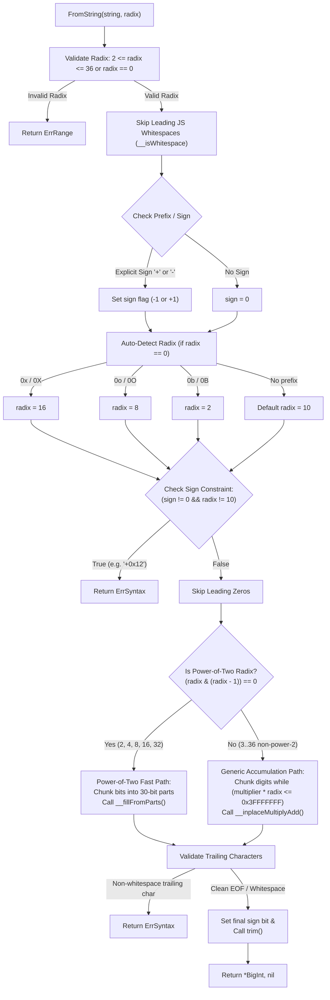

# Design Review 01: Construction & Parsing

- **Status**: APPROVED BY USER
- **Cluster**: 1 — Construction & Parsing
- **Reference**: `jsbi/lib/jsbi.ts` lines 14-57, 592-609, 611-627, 655-709, 712-914.

---

## 1. Objectives & API Scope
Cluster 1 implements core data representations and constructors converting native Go types, strings, floats, and booleans into `BigInt` instances according to JSBI / ECMAScript BigInt semantics.

### Target API Surface
```go
package jsbi

import "errors"

var (
    ErrSyntax = errors.New("SyntaxError: invalid BigInt string")
    ErrRange  = errors.New("RangeError: invalid value or radix out of range")
    ErrType   = errors.New("TypeError: cannot convert value to BigInt")
)

type BigInt struct {
    sign   bool     // true if negative, false if positive or zero
    digits []uint32 // 30-bit limbs (least-significant digit at index 0)
}

// Factory Constructors
func BigIntVal(v interface{}) (*BigInt, error)
func FromInt64(v int64) *BigInt
func FromUint64(v uint64) *BigInt
func FromFloat64(v float64) (*BigInt, error)
func FromString(s string, radix int) (*BigInt, error)
func FromBool(b bool) *BigInt

// Internal Helper Factories
func zero() *BigInt
func oneDigit(value uint32, sign bool) *BigInt
```

---

## 2. Representation & Invariants

### 30-Bit Digit Limb Model
JSBI represents numbers using arrays of 30-bit digits:
- `kDigitBits = 30`
- `kDigitMask = 0x3FFFFFFF`
- `kMaxLength = 1 << 25` (max digit count)

### Data Invariants
1. **Zero Representation**: Zero must always be canonicalized as `sign = false` and `len(digits) == 0`.
2. **No Unnecessary Digits**: `digits` must never contain trailing zeros at the most-significant positions. `trim()` must remove top zero digits.
3. **Limb Bounds**: Every limb `digits[i]` must satisfy `0 <= digits[i] <= 0x3FFFFFFF`.
4. **Public Value Semantics vs. Internal In-Place Mutation [GO DESIGN DECISION / INFERENCE]**:
   - JSBI internally mutates objects during intermediate calculation steps (e.g. `__trim()`, `__inplaceMultiplyAdd()`, `__initializeDigits()`).
   - For the Go port, public operations return newly allocated `*BigInt` instances to preserve value semantics for callers, while internal helper methods may mutate un-exported working instances during construction before returning.

---

## 3. Algorithm Specifications

### 3.1 `FromInt64(v int64)` & `FromUint64(v uint64)`
- For `v == 0`: Return `zero()`.
- For `v` fitting in 30 bits (`0 <= abs(v) <= 0x3FFFFFFF`): Return `oneDigit(uint32(abs(v)), sign)`.
- For 64-bit integers spanning multiple limbs:
  - Extract 30-bit chunks:
    - `d0 = uint32(u & 0x3FFFFFFF)`
    - `d1 = uint32((u >> 30) & 0x3FFFFFFF)`
    - `d2 = uint32(u >> 60)`
  - Allocate digits slice, populate limbs, and call `trim()`.

### 3.2 `FromFloat64(value float64)`
- Check for non-finite (`NaN`, `+Inf`, `-Inf`) or non-integer (`math.Floor(value) != value`) -> return `ErrRange`.
- Decode IEEE 754 float binary64 representation (`math.Float64bits(value)`):
  - Extract sign (bit 63), raw exponent (bits 52-62), mantissa (bits 0-51).
  - Add implicit hidden bit `1 << 52` for normalized floats.
  - Compute unbiased exponent `exponent = rawExp - 1023`.
  - If `exponent < 0`: return `zero()`.
  - Calculate required digit count `digits = (exponent / 30) + 1`.
  - Map mantissa bits to 30-bit limbs via bit shifts mirroring `JSBI.__fromDouble`.

### 3.3 `FromString(s string, radix int)`
- **Radix Validation**: If `radix != 0` and (`radix < 2` or `radix > 36`), return `ErrRange`.
- **Whitespace & Sign Parsing**:
  - Skip leading JS-compliant whitespace characters.
  - Parse sign prefix (`+` -> sign=0, `-` -> sign=-1).
- **Auto-Radix Detection** (when `radix == 0`):
  - Check prefix: `0x`/`0X` -> radix 16; `0o`/`0O` -> radix 8; `0b`/`0B` -> radix 2; default -> radix 10.
  - If explicit sign (`+`/`-`) is present with non-decimal radix (`0x`, `0b`, `0o`), return `ErrSyntax`.
- **Power-of-Two Radix Fast Path** (radix 2, 4, 8, 16, 32):
  - Group characters into 30-bit accumulators.
  - Populate limbs via `__fillFromParts`.
- **Generic Radix Path** (radix 3..36 non-power-of-two):
  - Accumulate digit chunks fitting in 30 bits (`multiplier * radix <= 0x3FFFFFFF`).
  - In-place multiply-accumulate (`result = result * multiplier + chunk`).
- **Trailing Validation**: Ensure remaining characters are strictly whitespace. Return `ErrSyntax` on invalid digits or bad syntax.

---

## 4. `FromString` Call-Flow Diagram



---

## 5. Complexity & Allocation Analysis
- **`FromInt64` / `FromUint64`**: $O(1)$ time, 1 allocation (1 to 3 limbs).
- **`FromFloat64`**: $O(\text{digits})$ time, 1 allocation ($1 \dots 35$ limbs).
- **`FromString`**:
  - Power-of-two radix: $O(N)$ time where $N$ is string length, $O(N/30)$ limbs.
  - Generic radix: $O(N^2)$ time for large strings via chunked multiply-add.

---

## 6. Risk Assessment & Mitigations
| Risk | Mitigation |
| :--- | :--- |
| Bit shift overflow during 64-bit int limb splitting | Explicit unit testing on boundary values (`math.MinInt64`, `math.MaxInt64`, `math.MaxUint64`). |
| Incomplete JS whitespace matching | Implement explicit JS whitespace predicate covering unicode space separators and control codes (`0x09`-`0x0D`, `0xA0`, `0xFEFF`). |
| Sign loss on negative zero float `-0.0` | Explicit zero normalization in `trim()` setting `sign = false`. |
