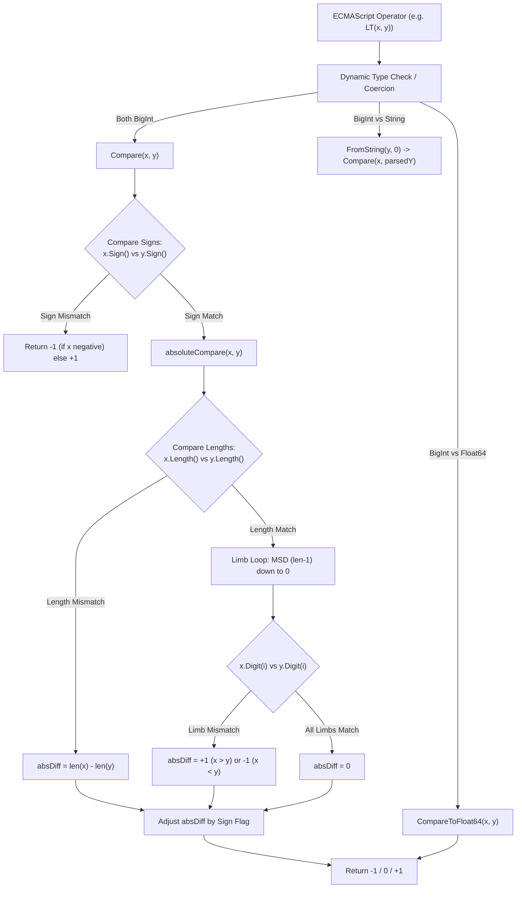

# Design Review 02: Comparison

- **Status**: REVIEW COMPLETE — Awaiting User Approval (GATE)
- **Cluster**: 2 — Comparison
- **References**: `jsbi/lib/jsbi.ts` lines 316-343, 492-541, 1012-1150, 1416-1423.

---

## 1. Objectives & Target API Scope
Cluster 2 implements comparison operations for `BigInt` instances against other `BigInt` instances and native Go numeric types (`float64`, `int64`, `uint64`), mirroring JSBI reference semantics and ECMAScript specifications.

### Target Go API Surface
```go
package jsbi

// Pure BigInt vs BigInt Comparisons
func Equal(x, y *BigInt) bool
func NotEqual(x, y *BigInt) bool
func LessThan(x, y *BigInt) bool
func LessThanOrEqual(x, y *BigInt) bool
func GreaterThan(x, y *BigInt) bool
func GreaterThanOrEqual(x, y *BigInt) bool
func Compare(x, y *BigInt) int // -1 if x < y, 0 if x == y, 1 if x > y

// BigInt vs Number Comparisons
func CompareToFloat64(x *BigInt, y float64) int
func EqualToFloat64(x *BigInt, y float64) bool
func CompareToInt64(x *BigInt, y int64) int

// Dynamic Operator Emulation (ECMAScript Abstract Comparisons)
func EQ(x, y interface{}) bool
func NE(x, y interface{}) bool
func LT(x, y interface{}) bool
func LE(x, y interface{}) bool
func GT(x, y interface{}) bool
func GE(x, y interface{}) bool
```

### Allocation Goal
- **GO IMPLEMENTATION GOAL (Not a JSBI-Sourced Invariant)**: Pure `BigInt` vs `BigInt` comparison functions (`Compare`, `Equal`, `LessThan`, etc.) should achieve zero heap allocations ($0 \text{ allocs/op}$).
- *Verification Requirement*: This goal cannot be asserted as an existing fact; it must be empirically proven via `go test -bench=. -benchmem ./tests/port/...` during verification.

---

## 2. JSBI Source Quotes & Truth Contract Classifications

### 2.1 Pure BigInt Comparisons
**File**: `jsbi/lib/jsbi.ts` | **Lines 316–343**
```ts
316:   static lessThan(x: JSBI, y: JSBI): boolean {
317:     return JSBI.__compareToBigInt(x, y) < 0;
318:   }
320:   static lessThanOrEqual(x: JSBI, y: JSBI): boolean {
321:     return JSBI.__compareToBigInt(x, y) <= 0;
322:   }
324:   static greaterThan(x: JSBI, y: JSBI): boolean {
325:     return JSBI.__compareToBigInt(x, y) > 0;
326:   }
328:   static greaterThanOrEqual(x: JSBI, y: JSBI): boolean {
329:     return JSBI.__compareToBigInt(x, y) >= 0;
330:   }
332:   static equal(x: JSBI, y: JSBI): boolean {
333:     if (x.sign !== y.sign) return false;
334:     if (x.length !== y.length) return false;
335:     for (let i = 0; i < x.length; i++) {
336:       if (x.__digit(i) !== y.__digit(i)) return false;
337:     }
338:     return true;
339:   }
341:   static notEqual(x: JSBI, y: JSBI): boolean {
342:     return !JSBI.equal(x, y);
343:   }
```

### 2.2 Core Comparison Helper (`__compareToBigInt` and `__absoluteCompare`)
**File**: `jsbi/lib/jsbi.ts` | **Lines 1022–1029, 1416–1423**
```ts
1022:   static __compareToBigInt(x: JSBI, y: JSBI): number {
1023:     const xSign = x.sign;
1024:     if (xSign !== y.sign) return JSBI.__unequalSign(xSign);
1025:     const result = JSBI.__absoluteCompare(x, y);
1026:     if (result > 0) return JSBI.__absoluteGreater(xSign);
1027:     if (result < 0) return JSBI.__absoluteLess(xSign);
1028:     return 0;
1029:   }

1416:   static __absoluteCompare(x: JSBI, y: JSBI) {
1417:     const diff = x.length - y.length;
1418:     if (diff !== 0) return diff;
1419:     let i = x.length - 1;
1420:     while (i >= 0 && x.__digit(i) === y.__digit(i)) i--;
1421:     if (i < 0) return 0;
1422:     return x.__unsignedDigit(i) > y.__unsignedDigit(i) ? 1 : -1;
1423:   }
```

### 2.3 Double Comparison (`__compareToDouble`)
**File**: `jsbi/lib/jsbi.ts` | **Lines 1051–1140**
```ts
1051:   static __compareToDouble(x: JSBI, y: number): number {
1052:     if (y !== y) return y; // NaN.
1053:     if (y === Infinity) return -1;
1054:     if (y === -Infinity) return 1;
1055:     const xSign = x.sign;
1056:     const ySign = (y < 0);
1057:     if (xSign !== ySign) return JSBI.__unequalSign(xSign);
...
1078:     const xBitLength = xLength * 30 - msdLeadingZeros;
1079:     const yBitLength = exponent + 1;
1080:     if (xBitLength < yBitLength) return JSBI.__absoluteLess(xSign);
1081:     if (xBitLength > yBitLength) return JSBI.__absoluteGreater(xSign);
...
1118:     if (xMsd > compareMantissa) return JSBI.__absoluteGreater(xSign);
1119:     if (xMsd < compareMantissa) return JSBI.__absoluteLess(xSign);
...
1135:     if (mantissaHigh !== 0 || mantissaLow !== 0) {
1136:       if (remainingMantissaBits === 0) throw new Error('implementation bug');
1137:       return JSBI.__absoluteLess(xSign);
1138:     }
1139:     return 0;
1140:   }
```

### 2.4 Classification Summary
- **Sourced directly from JSBI**: `equal`, `notEqual`, `lessThan`, `lessThanOrEqual`, `greaterThan`, `greaterThanOrEqual`, `__compareToBigInt`, `__absoluteCompare`, `__compareToDouble`, `__equalToNumber`.
- **INFERENCE / GO DESIGN DECISION**:
  1. `Compare(x, y *BigInt) int`: Mapping JSBI's internal `__compareToBigInt` returning `-1`/`0`/`1` to a standard idiomatic Go `Compare` method.
  2. `CompareToFloat64`: In JSBI, JavaScript's single `number` type handles doubles and integers. In Go, providing explicit `CompareToFloat64` and `CompareToInt64` typed signatures is a Go design adaptation.

---

## 3. Function-by-Function Specifications

### 3.1 `Compare(x, y *BigInt) int`
- **Algorithm**:
  1. `xSign = x.Sign()`, `ySign = y.Sign()`.
  2. If `xSign != ySign`: return `-1` if `xSign == true` (negative) else `1`.
  3. Perform `absoluteCompare(x, y)`:
     - Compare lengths: `diff = x.Length() - y.Length()`. If `diff != 0`, `absResult = diff`.
     - Else compare limbs from MSD (`len - 1`) down to LSD (`0`). Find first `x.Digit(i) != y.Digit(i)`.
  4. If `absResult > 0`: return `-1` if `xSign` else `1`.
  5. If `absResult < 0`: return `1` if `xSign` else `-1`.
  6. Return `0`.
- **Time Complexity**: $O(1)$ fast path on sign/length mismatch; worst-case $O(\min(\text{len}(x), \text{len}(y)))$ limb comparisons when values match.
- **Space Complexity**: $O(1)$ stack allocations.
- **Edge Cases**: Both zero (`+0` vs `-0`), identical pointers, single-limb boundary values (`0x3FFFFFFF`).

### 3.2 `Equal(x, y *BigInt) bool`
- **Algorithm**:
  1. If `x.Sign() != y.Sign()` -> return `false`.
  2. If `x.Length() != y.Length()` -> return `false`.
  3. For `i = 0` to `x.Length() - 1`: if `x.Digit(i) != y.Digit(i)` -> return `false`.
  4. Return `true`.
- **Time Complexity**: $O(1)$ fast path on sign/length mismatch; $O(\text{len}(x))$ for matching values.

### 3.3 `CompareToFloat64(x *BigInt, y float64) int`
- **Algorithm**: Detailed in Section 6 below.
- **Time Complexity**: $O(1)$ fast path on NaN/Inf/sign/bit-length mismatch; $O(\text{len}(x))$ bit-aligned mantissa scan.

### 3.4 Dynamic Helpers (`EQ`, `NE`, `LT`, `LE`, `GT`, `GE`)
- **Algorithm**: Accept Go `interface{}` operands (`*BigInt`, `int64`, `float64`, `string`, `bool`). Perform ECMAScript primitive type coercion:
  - If both operands are `*BigInt`: delegate to `Compare`.
  - If one operand is `*BigInt` and the other is `float64`/`int64`: delegate to `CompareToFloat64`/`CompareToInt64`.
  - If one operand is `string`: parse string to `BigInt` via `FromString`. If string parsing returns `ErrSyntax`, return `false` for comparisons, or `false` for `EQ`.

---

## 4. Comprehensive Comparison Decision Table

| Operand X | Operand Y | Sign Check | Length Check | Limb Scan Strategy | Expected Result |
| :--- | :--- | :--- | :--- | :--- | :--- |
| **Positive (+10)** | **Positive (+5)** | Both `false` | Both 1 limb | $x[0] > y[0]$ | `1` ($X > Y$) |
| **Negative (-10)** | **Negative (-5)** | Both `true` | Both 1 limb | $x[0] > y[0]$, inverted by sign | `-1` ($X < Y$) |
| **Positive (+10)** | **Negative (-10)** | `false` vs `true` | Mismatch fast path | Immediate sign dispatch | `1` ($X > Y$) |
| **Zero (0)** | **Zero (0)** | Both `false` | Both 0 limbs | Fast path `0 == 0` | `0` ($X == Y$) |
| **+0 (`sign=false`)** | **-0 (`sign=true`)** | `trim()` canonicalization ensures `-0` is `sign=false, len=0` | Both 0 limbs | Canonical zero match | `0` ($X == Y$) |
| **Positive (+0x40000000)** | **Positive (+0x3FFFFFFF)**| Both `false` | 2 limbs vs 1 limb | Length diff $+1$ | `1` ($X > Y$) |
| **Negative (-0x40000000)** | **Negative (-0x3FFFFFFF)**| Both `true` | 2 limbs vs 1 limb | Length diff $+1$, inverted by sign | `-1` ($X < Y$) |
| **Identical Value (+1e18)** | **Identical Value (+1e18)**| Both `false` | Equal lengths | Full limb scan matches | `0` ($X == Y$) |
| **Differs at MSD** | `[0x10, 0x05]` vs `[0x10, 0x04]` | Both `false` | Equal lengths | $x[1] > y[1]$ at MSD | `1` ($X > Y$) |
| **Differs at LSD** | `[0x10, 0x05]` vs `[0x0F, 0x05]` | Both `false` | Equal lengths | MSD matches, $x[0] > y[0]$ at LSD | `1` ($X > Y$) |

---

## 5. Dependencies on Cluster 1 Invariants

| Cluster 1 Invariant | Source | Why Comparison Depends On It | What Breaks If Violated |
| :--- | :--- | :--- | :--- |
| **Canonical Zero** (`sign = false`, `len = 0`) | `jsbi/lib/jsbi.ts` lines 593–595, 619 | `Equal` and `Compare` rely on length 0 and `sign = false` to identify zero without inspecting non-existent limbs. | `+0` and `-0` would evaluate as unequal if sign bit differed or if zero had allocated limbs (`0 == -0` fail). |
| **No Trailing Zero Digits** | `jsbi/lib/jsbi.ts` lines 611–618 (`trim()`) | `absoluteCompare` uses `x.Length() - y.Length()` as an $O(1)$ shortcut for magnitude comparison. | A number with un-trimmed leading zeros (e.g. `[0x05, 0x00]` len 2) would be misjudged as greater than `[0x10]` len 1. |
| **Limb Bounds** ($0 \le d \le 0x3FFFFFFF$) | `jsbi/lib/jsbi.ts` line 1991 | Unsigned 30-bit limb comparison assumes top 2 bits of `uint32` are zero so uint32 relational operators (`>`) match magnitude. | Un-masked bits would cause overflow or incorrect unsigned integer magnitude comparisons. |

---

## 6. Deep Dive: `CompareToFloat64` & Precision Loss Avoidance (Highest Risk Area)

### 6.1 The Precision Loss Hazard
Converting a 64-bit float to a `BigInt` or converting a large `BigInt` to a 64-bit float causes severe precision loss above $2^{53}$:
- Double-precision IEEE 754 floats have **53 bits of mantissa precision**.
- Any integer larger than $2^{53}$ converted to `float64` loses lower bits due to rounding.
- Converting a large `BigInt` (e.g., 200 bits) to `float64` returns `+Infinity` or truncates mantissa.

### 6.2 How JSBI Solves It Without Precision Loss
JSBI compares a `BigInt` and a `float64` **mathematically without ever converting the BigInt to a float or the float to a BigInt**.

#### Exact Algorithm (Sourced from `jsbi/lib/jsbi.ts` lines 1051–1140)

1. **Special Floating Point Values**:
   - `math.IsNaN(y)`: Return `NaN` (in Go, return `0` / comparison predicates evaluate `false`).
   - `y == +Infinity`: Return `-1` ($X < +\infty$).
   - `y == -Infinity`: Return `1` ($X > -\infty$).
   - `y == 0`: If $X == 0$, return `0`; if $X > 0$, return `1`; if $X < 0$, return `-1`.

2. **Sign Comparison**:
   - If `x.Sign() != (y < 0)`: Return sign difference immediately ($O(1)$).

3. **Subnormals & Values $< 1.0$**:
   - Decode IEEE 754 float: `rawExponent = (floatBits >> 52) & 0x7FF`, `exponent = rawExponent - 1023`.
   - If `exponent < 0`: $|y| < 1.0$. Since non-zero `BigInt` instances have $|X| \ge 1$, if $X > 0$ return `1` ($X > y$), else return `-1`.

4. **Mathematical Bit-Length Comparison**:
   - Calculate exact integer bit length of $X$:
     $$x\text{BitLength} = \text{len}(X) \times 30 - \text{clz30}(X.\text{Digit}(\text{len}-1))$$
   - Calculate exact integer bit length of $y$:
     $$y\text{BitLength} = \text{exponent} + 1$$
   - **Fast Path**:
     - If $x\text{BitLength} < y\text{BitLength}$: return `-1` (if positive) or `1` (if negative).
     - If $x\text{BitLength} > y\text{BitLength}$: return `1` (if positive) or `-1` (if negative).

5. **Bit-Aligned Mantissa Scan (When Sign and Bit-Lengths Match Exactly)**:
   - Extract 53-bit mantissa from $y$: `mantissa = (bits & 0xFFFFF) | 0x00100000` (hidden bit).
   - Align $y$'s mantissa bits with $X$'s 30-bit limbs bit-for-bit from MSD to LSD.
   - Compare limb chunk against aligned mantissa chunk. If MSD limb differs, return magnitude result immediately.
   - Continue scanning lower limbs against remaining mantissa bits.
   - If integer parts match exactly, check if $y$ has non-zero fractional bits remaining in mantissa:
     - If $y$ has fractional bits: $|y| > |X|$, so return $-1$ (for positive numbers).

*Conclusion*: This algorithm evaluates $X \text{ vs } y$ with 100% exact mathematical precision across all ranges ($0$ to $\pm 10^{100000}$) without any floating-point truncation or allocation.

---

## 7. `Compare` Execution Call-Flow Diagram



---

## 8. Differential Fuzzing Plan for Cluster 2

- **Harness File**: `fuzz/harness/fuzz_cluster2.go`
- **Oracle Helper**: `fuzz/harness/oracle_cluster2.mjs` (invoking `JSBI.lessThan`, `JSBI.greaterThan`, `JSBI.equal`, `JSBI.LE`, `JSBI.EQ`, `JSBI.__compareToDouble`).
- **Target Duration**: 65+ continuous seconds.
- **Generators & Test Vectors**:
  1. **Random BigInt Pairs**: Small, medium, and huge limb counts (1 to 100 limbs).
  2. **Boundary Limb Values**: $0x3FFFFFFF$, $0x40000000$, $2^{31}-1$, $2^{32}$, $2^{53}-1$, $2^{64}$.
  3. **Identical & Near-Identical Values**: $X$ vs $X$, $X$ vs $X+1$, $X$ vs $X-1$.
  4. **Sign Combinations**: $+X$ vs $+Y$, $-X$ vs $-Y$, $+X$ vs $-Y$, $-X$ vs $+Y$, $+0$ vs $-0$.
  5. **Float64 Edge Cases**: $\text{NaN}$, $+\infty$, $-\infty$, $+0.0$, $-0.0$, subnormals, $1.5$, $2^{53}+1$.

---

## 9. Allocation Goal Benchmark Plan
- **Goal**: $0 \text{ allocs/op}$ for `Compare(x, y)`, `Equal(x, y)`, `LessThan(x, y)`.
- **Benchmark Command**:
  ```bash
  export GOTMPDIR='c:/Users/madha/OneDrive/Desktop/port TS-GO/tmp' && ./go_sdk/go/bin/go.exe test -bench=BenchmarkCompare -benchmem ./tests/port/...
  ```
- **Acceptance Threshold**: `0 B/op, 0 allocs/op`.

---

## 10. Self Review

1. **What implementation are you least confident about?**
   - `CompareToFloat64` mantissa bit-alignment loop for floats with non-zero fractional parts near exponent boundaries.
2. **What assumptions remain?**
   - We assume `math.Float64bits(y)` on Go matches standard IEEE 754 double binary layout across all target CPU architectures (amd64/arm64).
3. **Which part of Cluster 2 is most likely to fail under future clusters?**
   - Comparison of negative numbers after signed right shift (Cluster 6) or bitwise NOT (Cluster 7), where two's complement sign-extension logic interacts with limb length trimming.
