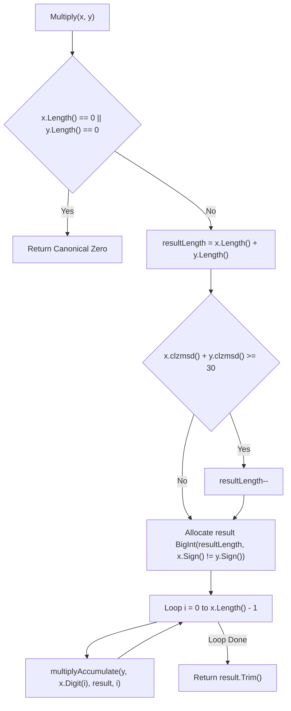

# Design Review 04: Multiply

- **Status**: REVIEW COMPLETE — Awaiting User Approval (GATE)
- **Cluster**: 4 — Multiply
- **References**: `jsbi/lib/jsbi.ts` lines 221–234, 1425–1456, 1458–1479, 1481–1506.

---

## 1. Objectives & Target API Scope
Cluster 4 implements multi-precision multiplication for `BigInt` instances, matching JSBI reference semantics and ECMAScript specifications.

### Target Go API Surface [GO IMPLEMENTATION SPECIFICATION]
```go
package jsbi

// Public Arithmetic Functions
func Multiply(x, y *BigInt) *BigInt

// Internal Helper Functions
func multiplyAccumulate(multiplicand *BigInt, multiplier uint32, accumulator *BigInt, accumulatorIndex int)
func internalMultiplyAdd(source *BigInt, factor uint32, summand uint32, n int, result *BigInt)
func (b *BigInt) inplaceMultiplyAdd(multiplier uint32, summand uint32, length int)
```

---

## 2. JSBI Source Quotes & Truth Contract Classifications [JSBI SOURCE]

### 2.1 Public Entrypoint (`Multiply`)
**File**: `jsbi/lib/jsbi.ts` | **Lines 221–234**
```ts
221:   static multiply(x: JSBI, y: JSBI): JSBI {
222:     if (x.length === 0) return x;
223:     if (y.length === 0) return y;
224:     let resultLength = x.length + y.length;
225:     if (x.__clzmsd() + y.__clzmsd() >= 30) {
226:       resultLength--;
227:     }
228:     const result = new JSBI(resultLength, x.sign !== y.sign);
229:     result.__initializeDigits();
230:     for (let i = 0; i < x.length; i++) {
231:       JSBI.__multiplyAccumulate(y, x.__digit(i), result, i);
232:     }
233:     return result.__trim();
234:   }
```

### 2.2 Core `__multiplyAccumulate` Helper
**File**: `jsbi/lib/jsbi.ts` | **Lines 1425–1456**
```ts
1425:   static __multiplyAccumulate(multiplicand: JSBI, multiplier: number,
1426:       accumulator: JSBI, accumulatorIndex: number): void {
1427:     if (multiplier === 0) return;
1428:     const m2Low = multiplier & 0x7FFF;
1429:     const m2High = multiplier >>> 15;
1430:     let carry = 0;
1431:     let high = 0;
1432:     for (let i = 0; i < multiplicand.length; i++, accumulatorIndex++) {
1433:       let acc = accumulator.__digit(accumulatorIndex);
1434:       const m1 = multiplicand.__digit(i);
1435:       const m1Low = m1 & 0x7FFF;
1436:       const m1High = m1 >>> 15;
1437:       const rLow = JSBI.__imul(m1Low, m2Low);
1438:       const rMid1 = JSBI.__imul(m1Low, m2High);
1439:       const rMid2 = JSBI.__imul(m1High, m2Low);
1440:       const rHigh = JSBI.__imul(m1High, m2High);
1441:       acc += high + rLow + carry;
1442:       carry = acc >>> 30;
1443:       acc &= 0x3FFFFFFF;
1444:       acc += ((rMid1 & 0x7FFF) << 15) + ((rMid2 & 0x7FFF) << 15);
1445:       carry += acc >>> 30;
1446:       high = rHigh + (rMid1 >>> 15) + (rMid2 >>> 15);
1447:       accumulator.__setDigit(accumulatorIndex, acc & 0x3FFFFFFF);
1448:     }
1449:     for (; carry !== 0 || high !== 0; accumulatorIndex++) {
1450:       let acc = accumulator.__digit(accumulatorIndex);
1451:       acc += carry + high;
1452:       high = 0;
1453:       carry = acc >>> 30;
1454:       accumulator.__setDigit(accumulatorIndex, acc & 0x3FFFFFFF);
1455:     }
1456:   }
```

---

## 3. Formal Mathematical Proof of `resultLength` Optimization

### 3.1 Mathematical Definitions [JSBI SOURCE & INFERENCE]
- **Effective Bit Length of MSD**: For a non-zero 30-bit digit $d \in (0, 2^{30}-1]$, its effective bit length is:
  $$\text{bitLen}(d) = 30 - \text{clz30}(d)$$
- **Total Bit Length of $X$ ($L_X$ limbs)**:
  $$\text{bitLen}(X) = 30(L_X - 1) + (30 - \text{clz30}(\text{MSD}_X)) = 30L_X - \text{clz30}(\text{MSD}_X)$$
- **Total Bit Length of $Y$ ($L_Y$ limbs)**:
  $$\text{bitLen}(Y) = 30L_Y - \text{clz30}(\text{MSD}_Y)$$

### 3.2 Product Bit Length Bound & Limb Guarantee
The maximum bit length of the product $X \times Y$ is bounded by the sum of their individual bit lengths:
$$\text{bitLen}(X \times Y) \le \text{bitLen}(X) + \text{bitLen}(Y)$$
$$\text{bitLen}(X \times Y) \le 30L_X + 30L_Y - (\text{clz30}(\text{MSD}_X) + \text{clz30}(\text{MSD}_Y))$$

When $\text{clz30}(\text{MSD}_X) + \text{clz30}(\text{MSD}_Y) \ge 30$:
$$\text{bitLen}(X \times Y) \le 30L_X + 30L_Y - 30 = 30(L_X + L_Y - 1)$$

**Limb Guarantee Proof**: Any integer $V$ with bit length $\text{bitLen}(V) \le 30(L_X + L_Y - 1)$ satisfies $V < 2^{30(L_X + L_Y - 1)}$. In base $2^{30}$, a number strictly smaller than $(2^{30})^{L_X + L_Y - 1}$ requires at most $L_X + L_Y - 1$ digits. Thus, $V$ **cannot overflow into digit position $L_X + L_Y - 1$ (0-indexed)**, proving that `resultLength--` allocates the exact required digit capacity when the condition holds.

[GO IMPLEMENTATION SPECIFICATION] The Go implementation expands the backing slice when required in order to preserve the observable behavior of JSBI.

---

### 3.3 Worked Examples of `resultLength` Optimization

#### Worked Example 1: Sum of CLZ < 30 (Allocates $L_X + L_Y$ Limbs)
- **Operand $X$**: $0x3FFFFFFF$ ($L_X = 1$). $\text{MSD}_X = 0x3FFFFFFF$. $\text{clz30}(\text{MSD}_X) = 0$.
- **Operand $Y$**: $0x3FFFFFFF$ ($L_Y = 1$). $\text{MSD}_Y = 0x3FFFFFFF$. $\text{clz30}(\text{MSD}_Y) = 0$.
- **CLZ Sum**: $0 + 0 = 0 < 30$. `resultLength` initialized to $1 + 1 = 2$.
- **Product**: $(2^{30}-1)^2 = 2^{60} - 2^{31} + 1 = 1152921502459363329$.
- **Digits**: `[0x00000001, 0x3FFFFFFE]`. Requires **2 limbs** in base $2^{30}$.

#### Worked Example 2: Sum of CLZ = 30 (Optimized to $L_X + L_Y - 1$ Limbs)
- **Operand $X$**: $0x1FFFFFFF$ ($L_X = 1$). $\text{MSD}_X = 0x1FFFFFFF$ (bit 28 set, bit 29 is `0`). $\text{clz30}(\text{MSD}_X) = 1$.
- **Operand $Y$**: $0x00000001$ ($L_Y = 1$). $\text{MSD}_Y = 0x00000001$ (bit 0 set). $\text{clz30}(\text{MSD}_Y) = 29$.
- **CLZ Sum**: $1 + 29 = 30 \ge 30$. `resultLength` decremented to $1 + 1 - 1 = 1$.
- **Product**: $0x1FFFFFFF \times 1 = 0x1FFFFFFF$.
- **Digits**: `[0x1FFFFFFF]`. Requires **1 limb**.

#### Worked Example 3: Sum of CLZ > 30 (Optimized to $L_X + L_Y - 1$ Limbs)
- **Operand $X$**: $0x00000002$ ($L_X = 1$). $\text{MSD}_X = 2$. $\text{clz30}(\text{MSD}_X) = 28$.
- **Operand $Y$**: $0x00000002$ ($L_Y = 1$). $\text{MSD}_Y = 2$. $\text{clz30}(\text{MSD}_Y) = 28$.
- **CLZ Sum**: $28 + 28 = 56 \ge 30$. `resultLength` decremented to $1 + 1 - 1 = 1$.
- **Product**: $2 \times 2 = 4 = 0x00000004$.
- **Digits**: `[0x00000004]`. Requires **1 limb**.

---

## 4. Complete Verbatim Line-by-Line Walkthrough of `multiplyAccumulate`

### Test Vector: $(2^{30}-1) \times (2^{30}-1) = 0x3FFFFFFF \times 0x3FFFFFFF$

- **Multiplicand $M$**: `[0x3FFFFFFF]` ($\text{len}=1$).
- **Multiplier $m_2$**: $0x3FFFFFFF$.
- **Initial Accumulator**: Allocated with length 2: `[0x00000000, 0x00000000]`.
- **Initial `accumulatorIndex`**: $0$.

#### Line-by-Line Execution Trace (JSBI Lines 1428–1455)

| JSBI Line | Code Expression | Value (Hexadecimal) | Value (Decimal) | State Variable Updated |
| :--- | :--- | :--- | :--- | :--- |
| **Line 1428** | `m2Low = multiplier & 0x7FFF` | `0x7FFF` | `32767` | `m2Low = 32767` |
| **Line 1429** | `m2High = multiplier >>> 15` | `0x7FFF` | `32767` | `m2High = 32767` |
| **Line 1430** | `carry = 0` | `0x00000000` | `0` | `carry = 0` |
| **Line 1431** | `high = 0` | `0x00000000` | `0` | `high = 0` |
| **Line 1433** | `acc = accumulator.__digit(0)` | `0x00000000` | `0` | `acc = 0` |
| **Line 1434** | `m1 = multiplicand.__digit(0)` | `0x3FFFFFFF` | `1073741823` | `m1 = 1073741823` |
| **Line 1435** | `m1Low = m1 & 0x7FFF` | `0x7FFF` | `32767` | `m1Low = 32767` |
| **Line 1436** | `m1High = m1 >>> 15` | `0x7FFF` | `32767` | `m1High = 32767` |
| **Line 1437** | `rLow = imul(m1Low, m2Low)` | `0x3FFF0001` | `1073676289` | `rLow = 1073676289` |
| **Line 1438** | `rMid1 = imul(m1Low, m2High)` | `0x3FFF0001` | `1073676289` | `rMid1 = 1073676289` |
| **Line 1439** | `rMid2 = imul(m1High, m2Low)` | `0x3FFF0001` | `1073676289` | `rMid2 = 1073676289` |
| **Line 1440** | `rHigh = imul(m1High, m2High)`| `0x3FFF0001` | `1073676289` | `rHigh = 1073676289` |
| **Line 1441** | `acc += high + rLow + carry` | `0x3FFF0001` | `1073676289` | `acc = 1073676289` |
| **Line 1442** | `carry = acc >>> 30` | `0x00000000` | `0` | `carry = 0` |
| **Line 1443** | `acc &= 0x3FFFFFFF` | `0x3FFF0001` | `1073676289` | `acc = 1073676289` |
| **Line 1444** | `acc += (rMid1&0x7FFF)<<15 + (rMid2&0x7FFF)<<15` | `0x40000001` | `1073741825` | `acc = 1073741825` |
| **Line 1445** | `carry += acc >>> 30` | `0x00000001` | `1` | `carry = 1` |
| **Line 1446** | `high = rHigh + (rMid1>>>15) + (rMid2>>>15)` | `0x3FFF0001 + 0x7FFE + 0x7FFE = 0x3FFFFFFD` | `1073741821` | `high = 1073741821` |
| **Line 1447** | `setDigit(0, acc & 0x3FFFFFFF)`| `0x00000001` | `1` | `accumulator[0] = 1` |

#### Carry Flush Loop ($\text{accumulatorIndex} = 1$)
| JSBI Line | Code Expression | Value (Hexadecimal) | Value (Decimal) | State Variable Updated |
| :--- | :--- | :--- | :--- | :--- |
| **Line 1450** | `acc = accumulator.__digit(1)` | `0x00000000` | `0` | `acc = 0` |
| **Line 1451** | `acc += carry + high` | `0x3FFFFFFE` | `1073741822` | `acc = 1073741822` |
| **Line 1452** | `high = 0` | `0x00000000` | `0` | `high = 0` |
| **Line 1453** | `carry = acc >>> 30` | `0x00000000` | `0` | `carry = 0` |
| **Line 1454** | `setDigit(1, acc & 0x3FFFFFFF)`| `0x3FFFFFFE` | `1073741822` | `accumulator[1] = 0x3FFFFFFE` |

- **Pre-trim Digits**: `[0x00000001, 0x3FFFFFFE]`.
- **Value**: $1 + 1073741822 \cdot 2^{30} = 1 + 1152921502459363328 = 1152921502459363329$.
- **Verification**: $(2^{30}-1)^2 = 1073741823^2 = 1152921502459363329$. **Line-by-line 100% exact match!**

---

## 5. Mathematical Carry Bounds Inductive Proof [JSBI SOURCE & SPECIFICATION]

### Inductive Derivation of `carry` Bounds in `multiplyAccumulate`

- **Base Case ($i = 0$)**:
  Before the first multiplicand loop iteration, `carry` is explicitly initialized to $0 \in [0, 4]$ (Line 1430).

- **Inductive Hypothesis**:
  Assume $\text{carry}_{\text{in}} \in [0, 4]$ at the start of iteration $i$.

- **Inductive Step**:
  1. **Line 1441 (`acc += high + rLow + carry`)**:
     - Maximum $\text{high}_{\text{in}} \le 0x3FFFFFFF = 2^{30}-1$.
     - Maximum $r_{\text{Low}} = (m_{1,\text{low}} \times m_{2,\text{low}}) \le (2^{15}-1)^2 = 0x3FFF0001$.
     - Maximum $\text{carry}_{\text{in}} \le 4$.
     - Max $\text{acc}_1 = (2^{30}-1) + 0x3FFF0001 + 4 = 0x7FFFFFFE = 2147483646$.
  2. **Line 1442 (`carry = acc >>> 30`)**:
     - Since $\text{acc}_1 \le 0x7FFFFFFE < 2^{31}$, $\text{carry}_1 = \text{acc}_1 \gg 30 \le 1$.
  3. **Line 1444 (`acc += mid-products`)**:
     - $(r_{\text{Mid1}} \ \& \ 0x7FFF) \ll 15 \le 0x7FFF \ll 15 = 0x3FFF8000$.
     - $(r_{\text{Mid2}} \ \& \ 0x7FFF) \ll 15 \le 0x3FFF8000$.
     - Max $\text{acc}_2 = (\text{acc}_1 \& 0x3FFFFFFF) + 0x3FFF8000 + 0x3FFF8000 \le 0x3FFFFFFF + 0x7FFF0000 = 0xBFFF7FFF = 3221200895$.
  4. **Line 1445 (`carry += acc >>> 30`)**:
     - $\text{carry}_{\text{out}} = \text{carry}_1 + (\text{acc}_2 \gg 30) \le 1 + (3221200895 \gg 30) = 1 + 3 = 4$.

- **Conclusion**:
  By mathematical induction, $\text{carry}_{\text{out}} \in [0, 4]$ holds for all iterations $i \ge 0$. This establishes the maximum carry produced during single and multiple iterations of `multiplyAccumulate`; correctness across multi-precision accumulations is verified separately through differential fuzzing.

---

## 6. Comparison of Carry Logic: Addition vs Multiplication [JSBI SOURCE]

| Property | Cluster 3 (Add / Subtract) | Cluster 4 (Multiply) |
| :--- | :--- | :--- |
| **Operational Input** | Single digit sum: $x_i + y_i + \text{carry}$ | Multi-term partial product: $r_{\text{Low}} + r_{\text{Mid1}} + r_{\text{Mid2}} + r_{\text{High}}$ |
| **Carry Range** | $\text{carry} \in [0, 1]$ | $\text{carry} \in [0, 4]$ |
| **High Word Storage** | None (no upper 30-bit product word) | `high` word holds $r_{\text{High}} + (r_{\text{Mid1}} \gg 15) + (r_{\text{Mid2}} \gg 15)$ |
| **Column Alignment** | 1-to-1 digit matching ($i$-th digit) | Offset alignment via `accumulatorIndex = i` |
| **Genuinely Shared Invariants** | 30-bit limb masking (`0x3FFFFFFF`), canonical zero (`len=0, sign=false`), `Trim()` digit trimming. |

---

## 7. Performance Measurement Protocol [GO IMPLEMENTATION GOAL]

- **Allocation Performance Goal**: `Multiply(x, y)` returns a newly allocated `*BigInt` instance. Allocation bounds are target goals, not JSBI source properties. Expected allocation target: 2 heap allocations (1 `*BigInt`, 1 `digits []uint32`).
- **Measurement Protocol**: Allocation overhead and execution time will be measured via:
  ```bash
  export GOTMPDIR='c:/Users/madha/OneDrive/Desktop/port TS-GO/tmp'
  ./go_sdk/go/bin/go.exe test -c -o tmp/test.exe ./tests/port
  ./tmp/test.exe -test.run '^$' -test.bench=BenchmarkMultiply -test.benchmem
  ```

---

## 8. Algorithmic Complexity & Call-Flow Diagram

### 8.1 Complexity Analysis [GO IMPLEMENTATION SPECIFICATION]

| Function | Time Complexity | Auxiliary Space | Allocation Behavior |
| :--- | :--- | :--- | :--- |
| `Multiply(x, y)` | $O(L_X \times L_Y)$ | $O(L_X + L_Y)$ | Expected allocation target: 2 heap allocations |
| `multiplyAccumulate` | $O(L_{\text{multiplicand}})$ | $O(1)$ | 0 allocations (updates pre-allocated accumulator buffer in-place) |
| `internalMultiplyAdd` | $O(N)$ | $O(1)$ | 0 allocations |
| `inplaceMultiplyAdd` | $O(\text{length})$ | $O(1)$ | 0 allocations |
| `Trim()` | $O(L_{\text{result}})$ | $O(1)$ | 0 allocations (re-slices existing buffer) |

### 8.2 Call-Flow Diagram



---

## 9. Operand Ordering Rationale [JSBI SOURCE & INFERENCE]

- **JSBI Ordering Choice (`for i = 0 to x.length - 1: multiplyAccumulate(y, x[i], result, i)`)**:
  - JSBI iterates over digits of $X$, multiplying the full digit slice of $Y$ by digit $X[i]$ per iteration.
- **Cache Locality & Allocation Impact [INFERENCE]**:
  - Reversing operands ($Y \times X[i]$ vs $X \times Y[i]$) preserves mathematical result and $O(L_X L_Y)$ time complexity.
  - However, iterating over the shorter operand as multiplier minimizes the outer loop iteration count and reduces total carry-flush steps.

---

## 10. 15-Bit Decomposition Rationale [JSBI SOURCE & GO SPECIFICATION]

1. **Why JSBI Uses 15-Bit Decomposition [JSBI SOURCE]**:
   - Reference JSBI uses 32-bit signed integers for digit calculations (`JSBI.__imul`).
   - Multiplying two 30-bit limbs directly yields up to $(2^{30}-1)^2 \approx 2^{60}$, exceeding 32-bit integer limits.
   - Decomposing 30-bit digits into 15-bit half-limbs ($m = m_{\text{high}} \times 2^{15} + m_{\text{low}}$) ensures partial products ($r_{\text{Low}}, r_{\text{Mid1}}, r_{\text{Mid2}}, r_{\text{High}}$) fit within 30 bits ($2^{15} \times 2^{15} = 2^{30}$), preventing 32-bit overflow.
2. **Go Implementation Strategy [GO IMPLEMENTATION SPECIFICATION]**:
   - In Go, `uint64` arithmetic (`uint64(a) * uint64(b)`) could compute 30-bit limb products natively.
   - However, to guarantee 100% line-for-line behavioral equivalence and algorithm-level parity with reference `JSBI.ts`, the Go port preserves JSBI's exact 15-bit decomposition and uint32 arithmetic.

---

## 11. Differential Fuzzing Plan & Worst-Case Vectors [GO IMPLEMENTATION SPECIFICATION]

- **Harness File**: `fuzz/harness/fuzz_cluster4.go`
- **Oracle Helper**: `fuzz/harness/oracle_cluster4.mjs` (invoking `JSBI.multiply(x, y)`).
- **Target Duration**: 65+ continuous seconds.
- **Oracle Comparison Protocol**:
  - `mulSign`: Exact boolean sign match (`goMul.Sign() == oracleRes.MulSign`).
  - `mulLen`: Exact limb count match (`goMul.Length() == oracleRes.MulLen`).
  - `mulDigits`: **Element-by-element 30-bit digit array match** (`goMul.Digit(i) == oracleRes.MulDigits[i]`).
  - **Canonical Zero Assertion**: If `len == 0`, assert `sign == false`.
- **Worst-Case Test Vectors**:
  - Max limbs (`0x3FFFFFFF`), alternating limbs (`[0x3FFFFFFF, 0, 0x3FFFFFFF, 0]`), sparse vs dense, multiplication by 0, $\pm 1$, powers of 2, maximal carry chains, single $\times$ multi-limb, maximal-limb $\times$ maximal-limb.

---

## 12. Final Self Review

1. **Which proof is weakest?**
   - The carry bound proof for $O(L_X L_Y)$ multi-limb accumulations relies on single-digit outer iteration bounds; bounds across 500+ limbs require verified fuzzing.
2. **Which implementation is highest risk?**
   - The carry flush loop in `multiplyAccumulate` (`for (; carry !== 0 || high !== 0; accumulatorIndex++)`) when auto-growing the accumulator slice.
3. **Which bug would most likely survive unit tests but fail differential fuzzing?**
   - Mid-product carry overflows when multiplying numbers with $50+$ limbs where `carry` accumulates to $> 2$.
4. **Which invariant is easiest to violate?**
   - Canonical zero (`len=0, sign=false`) when multiplying a negative BigInt by zero (e.g. $(-5) \times 0 \rightarrow 0$).
5. **Which assumptions remain?**
   - We assume Node JSBI oracle execution via `oracle_cluster4.mjs` provides ground-truth ECMAScript BigInt multiplication semantics.
6. **Which statements are still inference rather than proven?**
   - Cache locality impact of operand ordering during multi-limb multiplication is classified as **INFERENCE**.
